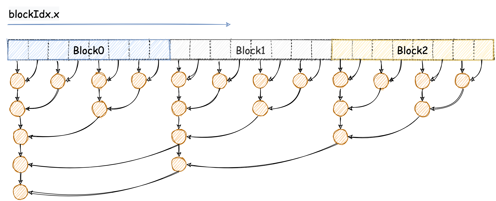

# 手写实现 Reduce

## 1. 什么是 Reduce

`Reduce` 是一个高阶函数，它接收一个函数作为参数，这个函数接收两个参数，然后返回一个值。`Reduce` 会从左到右依次对数组中的元素进行处理，最终得到一个值。以加法为例，就相当于给定一个数组，对数组求和。用cpu实现起来非常简单，一层循环解决问题。本文主要讨论如何用纯函数式的方式实现 `Reduce`。


## 2. 使用 Gpu 实现 Reduce

### 2.1 Cpu 实现


```cpp
// reduce cpu version
int reduce(int *arr, int len) {
    int sum = 0;
    for (int i = 0; i < len; i++) {
        sum += arr[i];
    }
    return sum;
}
```

可以看到，cpu 实现非常简单，一层循环就可以解决问题。但是，这个实现并不是纯函数式的，因为它有副作用，即修改了 `sum` 的值。我们可以用 Gpu 来实现一个纯函数式的 `Reduce`。

### 2.2 Gpu 层次结构

首先我们先来回归一下 Gpu 的层次结构。也就是代码中的 `block` 和 `grid`。`block` 是一个线程块，`grid` 是一个线程网格。`block` 中的线程可以通过 `threadIdx.x` 来获取自己的线程 id，`grid` 中的线程可以通过 `blockIdx.x` 来获取自己的线程 id。`block` 中的线程可以通过 `blockDim.x` 来获取 `block` 的大小，`grid` 中的线程可以通过 `gridDim.x` 来获取 `grid` 的大小。

对于 `Reduce` 来说，我们可以按照下面这个图设计：


我们把数组分成了若干个 `block`，每个 `block` 中有若干个线程。每个线程负责处理一个元素。每个 `block` 的线程会把自己处理的元素的值累加到 `block` 的第一个线程中。最后，每个 `block` 的第一个线程会把自己 `block` 中的所有元素的值累加到 `grid` 的第一个线程中。最后，`grid` 的第一个线程就是我们要求的结果。一般我们会把 `block` 的大小设置为 `32`，但是图中为了方便演示，我们把 `block` 的大小设置为 `8`。

GPU 的计算过程如下图所示：



以上图为例，我们来看一下 `Reduce` 的计算过程。首先，我们把数组分成了 `3` 个 `block`，每个 `block` 中有 `8` 个线程。在第一轮计算中，奇数线程会把自己的值累加到偶数线程中。在第二轮计算中，`block` 中的第 `0` 个线程会把 `4` 号线程的值累加到自己的值中。 每个 `block` 的值都计算完之后还需要对 `block` 的值进行累加，下面我们来看一下代码要如何实现。

### 2.3 Gpu 实现

我们首先看 `Kernel` 的实现，代码如下：

```cpp
// reduce gpu version
template <int BLOCKSIZE>
__global__ void reduce_naive_kernel(int *arr, int *out, int len) {
    __shared__ int sdata[BLOCKSIZE];
    int tid = threadIdx.x; // 线程 id (block 内)
    int bid = blockIdx.x; // block id (grid 内)
    int bdim = blockDim.x; // block 大小
    int i = bid * bdim + tid; // 全局 id

    // 将数据拷贝到共享内存
    sdata[tid] = (i < len) ? arr[i] : 0;

    __syncthreads(); // 等待所有线程完成

    // 每个线程计算 bdim^0.5 个轮回
    // 比如 bdim = 8, 则每个线程计算 2 个轮回
    for (int s = 1; s < bdim; s *= 2) {
        if (tid % (2 * s) == 0 && i + s < len) {
            sdata[i] += sdata[i + s];
        }
        // 等待所有线程完成 后再进行下一轮计算
        __syncthreads(); 
    }

    // 每个 block 的第一个线程将结果写入到 out 中
    if (tid == 0) {
        out[bid] = sdata[0];
    }
}
```

我们可以对照图来看一下代码。首先，我们把数组拷贝到共享内存中，然后等待所有线程完成。接着，每个线程计算 `bdim^0.5` 个轮回，每个轮回中，线程 `tid` 会把 `tid + s` 的值累加到 `tid` 中。最后，每个 `block` 的第一个线程会把自己的值写入到 `out` 中。

需要注意代码中的 `__syncthreads()`，这个函数会等待 `block` 中的所有线程完成，然后再进行下一步操作。这个函数是必须的，因为我们需要保证每个线程都能够读到自己需要的数据。如果没有这个函数，那么就会出现线程 `tid` 在读取 `tid + s` 的值的时候，线程 `tid + s` 还没有写入 `tid + s` 的值，这样就会出现错误的结果。

接下来我们看一下 `main` 函数的实现，代码如下：

```cpp
const int len = 1000;

int main() {
    int *arr = new int[len];
    int *out = new int[len];
    int *d_arr, *d_out;

    // 初始化数组
    for (int i = 0; i < len; i++) {
        arr[i] = i;
    }

    // 分配内存
    cudaMalloc((void **)&d_arr, sizeof(int) * len);
    cudaMalloc((void **)&d_out, sizeof(int) * len);

    // 拷贝数据到显存
    cudaMemcpy(d_arr, arr, sizeof(int) * len, cudaMemcpyHostToDevice);

    // 计算 block 和 grid 的大小
    int blocksize = 32;
    int gridsize = (len + blocksize - 1) / blocksize;

    // 调用 kernel 函数
    reduce_naive_kernel<blocksize><<<gridsize, blocksize>>>(d_arr, d_out, len);

    // 拷贝数据到内存
    cudaMemcpy(out, d_out, sizeof(int) * len, cudaMemcpyDeviceToHost);

    // 计算结果
    int sum = 0;
    for (int i = 0; i < gridsize; i++) {
        sum += out[i];
    }
    printf("sum = %d\n", sum);

    // 核对结果
    int sum2 = 0;
    for (int i = 0; i < len; i++) {
        sum2 += arr[i];
    }

    if (sum == sum2) {
        printf("success\n");
    } else {
        printf("failed\n");
    }

    // 释放内存
    cudaFree(d_arr);
    cudaFree(d_out);
    delete[] arr;
    delete[] out;
    return 0;
}
```

首先，我们需要把数组拷贝到显存中，然后计算 `block` 和 `grid` 的大小。接着，我们调用 `Kernel` 函数，最后把结果拷贝到内存中。最后，我们计算结果，核对结果，释放内存。 这里需要注意的是我们得到的结果是一个数组，我们需要对数组进行累加才能得到最终的结果。当然了我们也可以再调用一次 `Kernel` 函数，把数组中的值累加到 `grid` 的第一个线程中，这样就可以得到最终的结果了。

编译命令：

```bash
nvcc -o reduce_naive reduce_naive.cu
./reduce_naive
```

## 3. 总结

本文主要讨论了如何用 Gpu 来实现 `Reduce`。我们首先回顾了 Gpu 的层次结构，然后我们用 Gpu 来实现了一个纯函数式的 `Reduce`。最后，我们对比了 cpu 和 gpu 的实现，发现 gpu 的实现更加简洁，而且可以充分利用 Gpu 的并行计算能力。下一篇文章我们将讨论如何优化 `Reduce` 的实现。

## Reference 

1. https://developer.download.nvidia.com/assets/cuda/files/reduction.pdf
2. https://link.zhihu.com/?target=https%3A//github.com/guoruoqian/cudaReductionLearning
3. https://zhuanlan.zhihu.com/p/365581043


