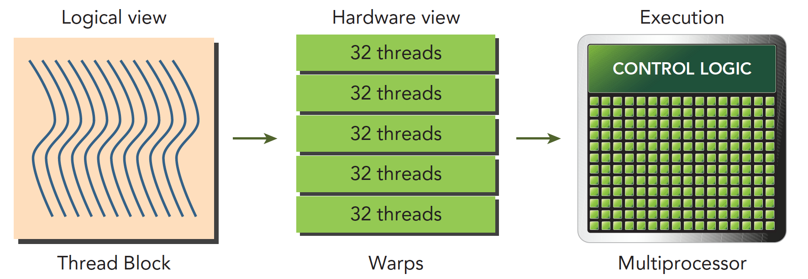
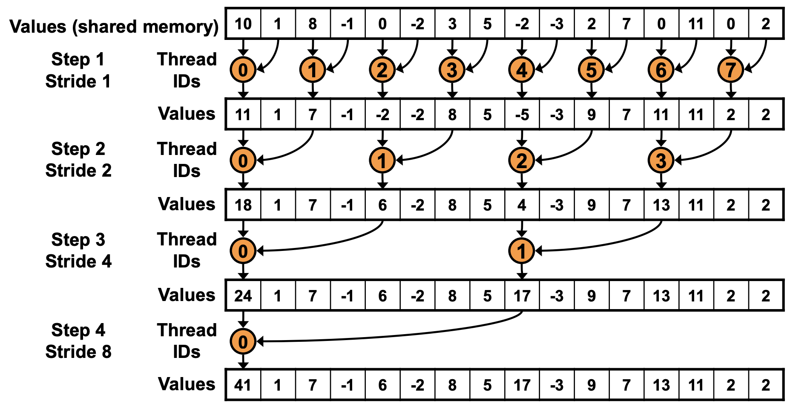

# Reduce 性能优化实践—交错寻址

上一篇文章中，我们手写了一个简单的 Reduce 算法，但是性能并不是很好，这一篇文章我们就来逐步优化这个算法。

## 1. 优化点分析

我们首先来看一下上一篇文章中的 Reduce 算法的性能瓶颈在哪里。上一篇文章中我们的实现代码有下面这个部分：

```cpp
for (int s = 1; s < bdim; s *= 2)
{
    if (tid % (2 * s) == 0 && i + s < len)
    {
        sdata[tid] += sdata[tid + s];
    }
    // 等待所有线程完成 后再进行下一轮计算
    __syncthreads();
}
```

这一部分的代码有俩个问题，一个 warp divergent，另一个是取模这个操作很昂贵。

### 1.1. Warp Divergent

我们先来看一下 warp divergent 这个问题。warp 是 SM 的基本执行单元。逻辑上我们认为 GPU 有多个计算网格，一个计算网格里面所有的线程就叫做一个线程块。在内核启动之后，线程块里的线程会被分配到某个 SM 上，然后在被分为多个 warp。下图可以很好的说明这个问题。

  

我们知道，一个 warp 有 32 个线程。一个 warp 中的线程执行着相同的指令。也就是说同一时间 warp 里面的线程要么执行 if 分支要么执行 else 分支。

不同的线程执行的数据是不一样的，同一时间 warp 里面的线程执行的指令又要完全一样。这就导致在部分线程满足 if 分支的条件并执行 if 分支的时候，其他的线程就会被阻塞，这样就导致了 Warp Divergent （线程束分化）的问题。

### 1.2 取模操作

GPU 设计的初衷是为了高度并行的图形处理和通用计算。取模操作涉及到除法，而除法是一个相对于其他算术运算而言较为复杂的操作，难以并行化。在 GPU 中，一些线程可能需要等待其他线程完成除法操作，导致并行性下降。取模操作通常伴随着对内存的访问，而内存访问模式对于性能具有重要影响。如果取模操作导致了不规则的内存访问模式，这可能使得缓存的效率下降，从而影响整体性能。

## 2. 使用交错寻址进行优化

之前的代码里面我们是基于线程的 id 来进行寻址的，偶数线程的行为和奇数线程的行为是不一样的。这样就导致了 warp divergent 的问题。同一个 warp 里面有一半的线程都没用上。想要解决这个问题，我们可以使用交错寻址的方式，代码如下：

```cpp
// 不使用交错寻址
for (int s = 1; s < bdim; s *= 2)
{
    if (tid % (2 * s) == 0 && i + s < len)
    {
        sdata[tid] += sdata[tid + s];
    }
    // 等待所有线程完成 后再进行下一轮计算
    __syncthreads();
}

// 使用交错寻址
for (int s = 1; s < bdim; s *= 2)
{
    int index = 2 * s * tid;
    if ((index + s < bdim) && (bdim * bid + s < len))
    {
        sdata[index] += sdata[index + s];
    }
}
```

让我们对比一下这俩种方式的寻址方式，在不使用交错寻址的情况下，计算原理图如下：

  

可以看到只有偶数线程在参与计算，奇数线程都是空闲的。而使用交错寻址的方式，计算原理图如下：

  

在 `BLOCKSIZE` 为 256 的情况下，一个 block 中分配 256 个线程，32 个线程为一组，绑定在一个 SIMD 单元。所以 256 个线程可以简单地理解为分配了 8 组 SIMD 单元。（但实际的硬件资源分配不是这样，因为一个 SM 的计算资源有限，不可能真的给每一个 block 都分配这么多的 SIMD 单元。）在第 1 次迭代中，warp 的 index 为 0-3 的进入分支，而 4-7 的 warp 的 index 大于等于 blockDim.x。由于每个 warp 都只进入一个分支，因此不存在 warp divergence 的情况。

在第 2 次迭代中，warp 的 index 为 0 和 1 的进入计算分支。在第 3 次迭代中，只有 warp 的 index为 0 的 warp 进入计算分支。而在第 4 次迭代中，仅有 warp 的 index 为 0 的 warp 的前 16 个线程进入分支。这时开始出现 warp divergence。通过这种方式，成功地消除了前 3 次迭代中的 warp divergence。

这样的写法也消除了取模操作，因为我们不再需要取模操作来判断线程的奇偶性。

编译运行代码：

```bash
nvcc -o reduce_interleaved_addressing reduce_interleaved_addressing.cu
./reduce_interleaved_addressing
```

同样的配置下和上一篇文章中的代码进行对比结果如下：

| 优化手段 | 运行时间(us) | 带宽 | 加速比 |
| --- | --- | --- | --- |
| Baseline | 3118.4 | 42.503GB/s | ~ |
| 交错寻址 | 1904.4 | 73.522GB/s | 1.64 |

## 总结

本文我们介绍了 Reduce 算法的性能优化实践。我们首先分析了 Reduce 算法的性能瓶颈，然后针对性的进行了优化。最后我们介绍了交错寻址的方式，成功地消除了前 3 次迭代中的 warp divergence。但是这样的写法也引入了新的问题，Bank Conflict。这个问题我们会在下一篇文章中进行介绍。


## Reference

1. https://developer.download.nvidia.com/assets/cuda/files/reduction.pdf
2. https://github.com/guoruoqian/cudaReductionLearning
3. https://zhuanlan.zhihu.com/p/365581043
4. http://www.giantpandacv.com/project/OneFlow/%E3%80%90BBuf%E7%9A%84CUDA%E7%AC%94%E8%AE%B0%E3%80%91%E4%B8%89%EF%BC%8Creduce%E4%BC%98%E5%8C%96%E5%85%A5%E9%97%A8%E5%AD%A6%E4%B9%A0%E7%AC%94%E8%AE%B0/


