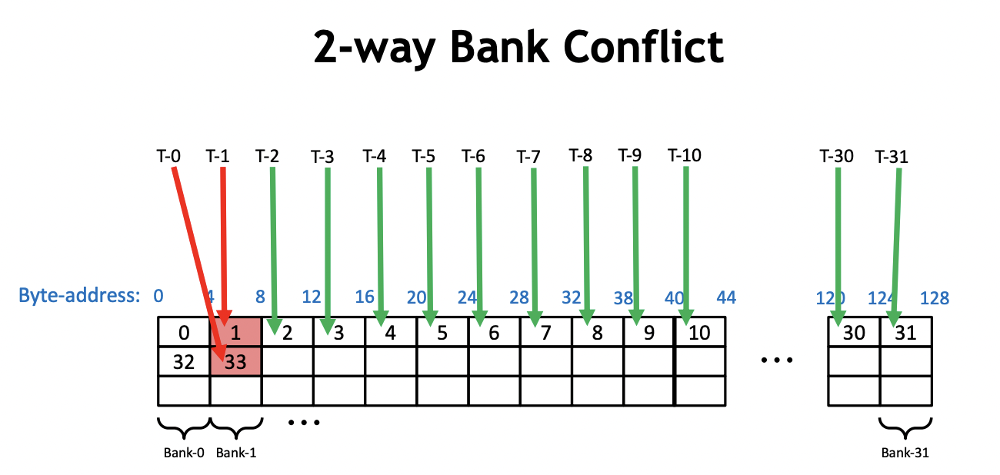
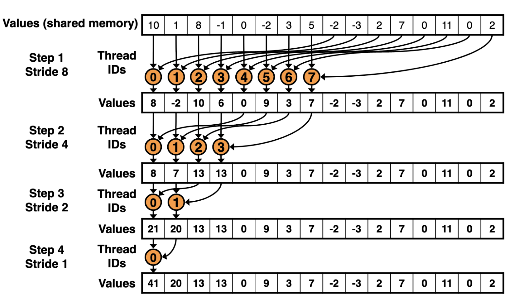

# 解决 bank conflict

上一篇文章中我们通过交叉寻址的方式解决了 warp divergence 的问题。具体的做法就是让连续的线程尽可能保持一样的行为，这样就不会出现分支判断的情况，从而避免了 warp divergence。但是这种做法也会带来一个新的问题，那就是 bank conflict。本文将会介绍 bank conflict 的原因以及解决方案。

## 1. Bank Conflict

Bank conflict 是指当多个线程同时访问同一个 bank 的时候，会出现 bank conflict。bank 是共享内存的最小单元，每个 bank 可以同时为一个线程提供数据。如果多个线程同时访问同一个 bank，那么它们的访问就会被串行化，从而降低性能。为了避免或减少访存冲突，可以使用一些技巧，如改变数据布局、使用 padding、使用 shuffle 指令等。

同一个 Block 的线程会共享一块共享内存，共享内存在逻辑上被分为 32 个 bank。当同一个 warp 中的线程访问同一个 bank 的时候，会出现 bank conflict。在最坏的情况下，即一个 warp 中的所有线程访问了相同 bank 的 32 个不同地址的话，那么这 32 个访问操作将会全部被序列化，大大降低了内存带宽。在一个 warp 内对同一个 bank 中的 n 个地址同时访问将导致 n 次内存事务，称为发生了 n 路 bank conflict。需要注意的是，不同 warp 中的线程之间不存在 bank conflict。

接下来让我们来分析上一个 Kernel 中的 bank conflict。上一个 Kernel 中，我们使用了交叉寻址的方式，使得连续的线程访问的地址不再连续。这样做的目的是为了避免 warp divergence。但是这样做也会导致 bank conflict。

我们以 0 号 warp 为例。在第一次迭代中，0 号线程需要加载 shared memory 的 0 号和 1 号地址，然后写回 0 号地址。同时，0 号 warp 的 16 号线程需要加载 shared memory 的 32 和 33 号地址，并写回 32 号地址。因此，在一个 warp 内同时访问了一个 bank 的不同内存地址，导致发生了 2 路的 Bank Conflict，如下图所示：

  

类似地，在第二次迭代过程中，0 号 warp 的 0 号线程会加载 0 号和 2 号地址并写回 0 号地址。然后，0 号 warp 的 8 号线程需要加载 shared memory 的 32 号和 34 号地址（228=32，32+2=34），并写回 32 号线程。此时，16 号线程会加载 64 号和 68 号地址，24 号线程会加载 96 号和 100 号地址。由于 0 号、32 号、64 号、96 号地址都在一个 bank 中，产生了 4 路的 Bank Conflict。这样以此类推，下一次迭代会产生 8 路的 Bank Conflict，使得整个 Kernel 一直受到 Bank Conflict 的影响。

我们可以使用 nvprof 来查看 bank conflict 的情况。

```bash
nvprof --events shared_st_bank_conflict ./reduce_interleaved_addressing
```

| Invocations | Event Name               | Min      | Max      | Avg      | Total    |
|-------------|--------------------------|----------|----------|----------|----------|
| 1           | shared_st_bank_conflict | 4587520  | 4587520  | 4587520  | 4587520  |


如果你的设备不支持 nvprof，你可以使用 nsight-compute 的命令行工具 ncu 来查看 bank conflict 的情况。

```bash
sudo ncu --metrics      l1tex__data_bank_conflicts_pipe_lsu_mem_shared_op_st.sum  ./reduce_interleaved_addressing
```


## 2. 解决方案

根据上面的分析我们了解到，只要让一个 warp 内的线程不是同一个 bank 的，就可以避免 bank conflict。下面我们来想一想如何让一个 warp 内的不同线程访问不同的 bank。

一个 warp 有 32 个线程，bank 也有 32 个。当 `BLOCKSIZE` 是 256 的时候，布局图如下所示：


每个 Block 里面有一半的线程是需要加载数据的，这些加载数据的线程就可能会发生 bank conflict。我们可以让这些线程访问不同的 bank。前面我们已经说过了为了防止线程束分化，所以这一半加载数据的线程就是 0-127 号线程。这 128 个线程可以分成 4 个 warp，每个 warp 有 32 个线程。我们可以让这 4 个 warp 分别访问 4 个不同的 bank。每个 warp 访问一个 bank。仔细看看上面的布局图，我们一共有 8 行，正好可以分成 4 个 warp，每个 warp 有 2 行。结合交叉寻址的方式，我们可以让每个 warp 访问一个 bank。这样就可以避免 bank conflict 了。我用不同颜色的线表示了不同的 warp，如下图所示：

  

0 号 warp 的 0 号线程访问 0 号 bank 的 0 号地址和 128 号地址，1 号 warp 的 0 号线程访问 1 号 bank 的 32 号地址和 128 号地址，2 号 warp 的 0 号线程访问 2 号 bank 的 64 号地址和 160 号地址，以此类推。

整体过程如下图所示：

  

> [!NOTE]
> 图里面的 block size 是 16 而不是 256，这是为了方便说明。实际上，我们的 block size 是 256。

了解了意图之后，我们就可以开始编写代码了。代码的改动也不对，主要是把循环迭代的顺序修改一下，使得每个 warp 访问一个 bank。具体的代码如下所示：

```cpp
// 修改之前
for (int s = 1; s < bdim; s *= 2)
{
    int index = 2 * s * tid;
    if ((index + s < bdim) && (bdim * bid + s < len))
    {
        sdata[index] += sdata[index + s];
    }
}

// 修改之后
for(int s=blockDim.x/2; s>0; s >>= 1) {
    if (tid < s){
        sdata[tid] += sdata[tid + s];
    }
    __syncthreads();
}
```

修改后我们可以再次运行 nvprof 来查看 bank conflict 的情况，输出如下所示：

| Invocations | Event Name               | Min      | Max      | Avg      | Total    |
|-------------|--------------------------|----------|----------|----------|----------|
| 1           | shared_st_bank_conflict | 0  | 0  | 0  | 0  |

性能和带宽的测试情况如下：

| 优化手段 | 运行时间(us) | 带宽 | 加速比 |
| --- | --- | --- | --- |
| Baseline | 3118.4 | 42.503GB/s | ~ |
| 交错寻址 | 1904.4 | 73.522GB/s | 1.64 |
| 解决 bank conflict | 1475.2 | 97.536GB/s | 2.29 |

可以看到，解决 bank conflict 之后，性能和带宽都有了很大的提升。

本文代码可以按如下方式编译运行：

```bash
nvcc -o reduce_bank_conflict_free reduce_bank_conflict_free.cu
```

## Reference 

- [https://developer.nvidia.com/blog/using-shared-memory-cuda-cc/](https://developer.nvidia.com/blog/using-shared-memory-cuda-cc/)
- [http://giantpandacv.com/project/OneFlow/%E3%80%90BBuf%E7%9A%84CUDA%E7%AC%94%E8%AE%B0%E3%80%91%E4%B8%89%EF%BC%8Creduce%E4%BC%98%E5%8C%96%E5%85%A5%E9%97%A8%E5%AD%A6%E4%B9%A0%E7%AC%94%E8%AE%B0/#2-bank-conflict](http://giantpandacv.com/project/OneFlow/%E3%80%90BBuf%E7%9A%84CUDA%E7%AC%94%E8%AE%B0%E3%80%91%E4%B8%89%EF%BC%8Creduce%E4%BC%98%E5%8C%96%E5%85%A5%E9%97%A8%E5%AD%A6%E4%B9%A0%E7%AC%94%E8%AE%B0/#2-bank-conflict)
- [https://github.com/BBuf/how-to-optim-algorithm-in-cuda](https://github.com/BBuf/how-to-optim-algorithm-in-cuda)

