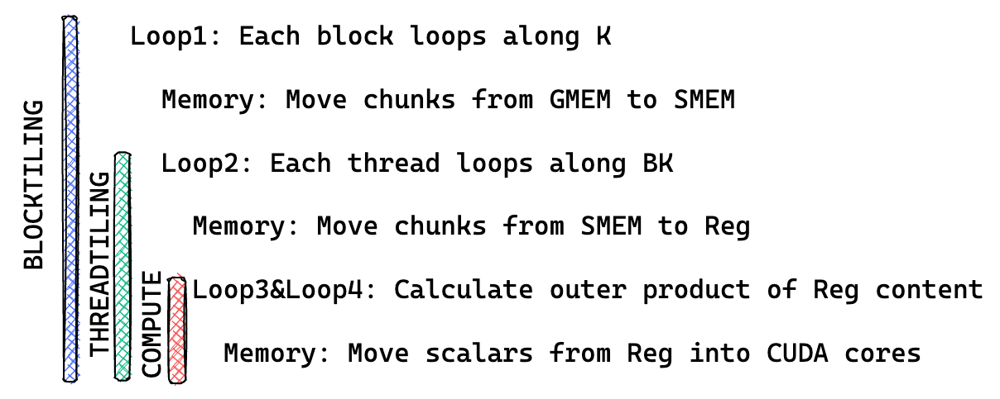
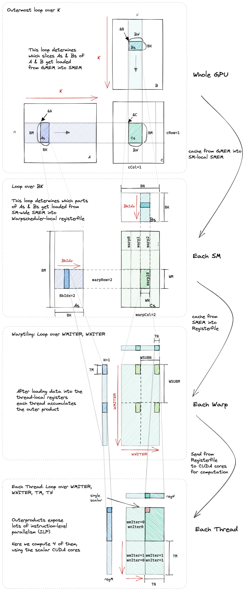

# Warp Tiling

## 1. 优化思路

上一个 Kernel 中我们使用向量化访存的方式来提高访存效率, 它的循环结构如下图所示:



第一个循环 (blocktiling loop) 是对 K 的循环, 这个循环中会将数据从全局内存移动到共享内存中, 第二个循环 (threadtiling loop) 是线程级别的循环, 这个循环中会将数据从共享内存移动到寄存器中, 第三和第四个循环是对寄存器中的数据进行计算。

本文中我们将会在第一个循环, 第二个循环之前加入一个 warp tiling 的循环, 以此来提高访存效率。Warp 是 GPU 硬件中的一个概念, 一个 warp 由 32 个线程组成, 这 32 个线程会被分配到一个 SM 中的一个 warp scheduler 中, warp scheduler 会负责调度这 32 个线程的执行。一个 SM 上可能会有多个 warp scheduler, 下图是一个 SM 中 warp scheduler 的示意图:


在 warp 级别上进行并行计算可以充分利用 GPU 的并行处理能力。通过同时执行多个 warp 中的线程，可以实现更高的计算吞吐量，从而加快整体计算速度。

在使用 warp tiling 之后, 我们的循环结构如下所示:

1. Block Tile: 不同的块可以在不同的 SM 上并行执行。
2. Warp Tile: 不同的 warps 可以在不同的 warp 调度器上并行执行，并且同时在同一个 warp 调度器上执行
3. Thread Tile: 指令可以在同一个 CUDA 核心上并行执行（即指令级并行性，又称 ILP）

:::note

ILP 是指在一个线程中的指令可以并行执行, warp tiling 会增加 warp 级别的并行性, 从而提高计算效率。

:::

下图给出了算法的整体流程图:



## 2. 代码实现

在了解了代码的整体结构之后, 我们来看一下 warp tiling 的代码实现。首先我们还是先来看看添加了 warp tiling 之后各个相对坐标要如何计算。相比上一个 Kernel 我们多了一层 warp tiling 的循环, warp id 和 warp 内 thread 的 id 计算方式是新加入的：

```cpp
const uint warp_idx = threadIdx.x / WARPSIZE;
const uint warp_col = warp_idx % (BN / WN);
const uint warp_row = warp_idx / (BN / WN);

// warp tile 的大小
// WM 是每个 Warp 处理数据的行数，WN 是每个 Warp 处理数据的列数
// 数据行数 / 迭代次数 = 每次迭代处理的行数
constexpr uint WSUBM = WM / WMITER;
constexpr uint WSUBN = WN / WNITER;

// warp 内的线程索引
const uint thread_idx_in_warp = threadIdx.x % WARPSIZE; // [0, 31]
const uint thread_col_in_warp = thread_idx_in_warp % (WSUBN / TN);
const uint thread_row_in_warp = thread_idx_in_warp / (WSUBN / TN);
```

`warp_idx` 很好理解, 它是当前 warp 在 block 中的索引, `warp_col` 和 `warp_row` 是当前 warp 在 block 中的坐标。`BN / WN` 是 block 中 warp 的列数, `warp_col` 是当前 warp 在 block 中的列索引, `warp_row` 是当前 warp 在 block 中的行索引。`WSUBM` 和 `WSUBN` 是 warp tile 的大小。`WM` 和 `WN` 是 block tile 的大小, `WMITER` 和 `WNITER` 是 warp tile 的迭代次数。

`thread_idx_in_warp` 是当前线程在 warp 中的索引, `thread_col_in_warp` 和 `thread_row_in_warp` 是当前线程在 warp 中的坐标。`WSUBN / TN` 是 warp 中线程的列数, `thread_col_in_warp` 是当前线程在 warp 中的列索引, `thread_row_in_warp` 是当前线程在 warp 中的行索引。

结合上面的算法流程图会更容易理解这些相对坐标的计算方式。

在计算了相对坐标之后, 我们就可以开始实现 warp tiling 的循环了，首先是将数据从全局内存移动到共享内存中，这一步和上一个 Kernel 中的实现是一样的:

```cpp
// 从全局内存加载 A 到共享内存
for (uint offset = 0; offset < BM; offset += stride_a)
{
    const float4 tmp = FETCH_FLOAT4(A[OFFSET(offset + inner_row_a, inner_col_a, K)]);
    smem_a[OFFSET(inner_col_a, offset + inner_row_a, BM)] = tmp.x;
    smem_a[OFFSET(inner_col_a + 1, offset + inner_row_a, BM)] = tmp.y;
    smem_a[OFFSET(inner_col_a + 2, offset + inner_row_a, BM)] = tmp.z;
    smem_a[OFFSET(inner_col_a + 3, offset + inner_row_a, BM)] = tmp.w;
}

// 从全局内存加载 B 到共享内存
for (uint offset = 0; offset < BK; offset += stride_b)
{
    FETCH_FLOAT4(smem_b[OFFSET(inner_row_b + offset, inner_col_b, BN)]) =
        FETCH_FLOAT4(B[OFFSET(inner_row_b + offset, inner_col_b, N)]);
}
```

在下一步 warp tiling 的循环中, 我们需要将数据从共享内存移动到寄存器中, 由于我们添加了 warp tiling 的循环, 所以将数据读取到寄存器中以及对数据进行计算的时候都多了 warp 层的循环:

```cpp
// 计算每个线程的部分结果
for (uint warp_sub_row_idx = 0; warp_sub_row_idx < WMITER; ++warp_sub_row_idx)
{
    for (uint warp_sub_col_idx = 0; warp_sub_col_idx < WNITER; ++warp_sub_col_idx)
    {
        for (int m = 0; m < TM; m++)
        {
            for (int n = 0; n < TN; n++)
            {
                // 计算矩阵乘法结果并累加到 thread_results 数组中
                thread_results[(warp_sub_row_idx * TM + m) * (WNITER * TN) + (warp_sub_col_idx * TN) + n] += reg_a[warp_sub_row_idx * TM + m] * reg_b[warp_sub_col_idx * TN + n];
            }
        }
    }
}
```

虽然看上去多了很多代码但是实际上 warp tiling 的实现并不复杂, 只是在原来的代码基础上多了一层 warp 的循环。在 warp tiling 的循环中我们将数据从共享内存移动到寄存器中, 并且对数据进行计算。

同理在最后的计算结果写回到全局内存的时候也多了 warp 层的循环:

```cpp
// 将线程的结果写入全局内存
for (uint warp_sub_row_idx = 0; warp_sub_row_idx < WMITER; ++warp_sub_row_idx)
{
    for (uint warp_sub_col_idx = 0; warp_sub_col_idx < WNITER; ++warp_sub_col_idx)
    {
        // 计算 C 的内存索引并将结果写入 C
        float *C_interim = C + (warp_sub_row_idx * WSUBM) * N + warp_sub_col_idx * WSUBN;
        for (int m = 0; m < TM; m++)
        {
            for (int n = 0; n < TN; n += 4)
            {
                FETCH_FLOAT4(C_interim[OFFSET(m + thread_row_in_warp * TM, n + thread_col_in_warp * TN, N)]) =
                    FETCH_FLOAT4(thread_results[(warp_sub_row_idx * TM + m) * (WNITER * TN) + (warp_sub_col_idx * TN) + n]);
            }
        }
    }
}
```

编译命令如下：

```bash
nvcc -o sgemm_warp_tiling sgemm_warp_tiling.cu
./sgemm_warp_tiling 256 256 256
```

## 3. 性能对比

我们将上该内核的性能和之前的内核进行比较，我们分别计算 256x256、512x512、1024x1024、2048x2048 （Matrix 1、Matrix 2、Matrix 3、Matrix 4、Matrix 5）的矩阵乘法的性能 (ns)。在 1080Ti 上运行，结果如下：


| Algorithm | Matrix 1 | Matrix 2 | Matrix 3 | Matrix 4 |
| --------- | -------- | -------- | -------- | -------- |
| Naive     | 95.5152  | 724.396  | 28424    | 228681   |
| 共享内存缓存块    | 40.5293  | 198.374  | 8245.68  | 59048.4  |
| 一维 Thread Tile     | 35.215  | 174.731  | 894.779  | 5880.03  |
| 二维 Thread Tile     | 34.708  | 92.946  | 557.829  | 3509.920  |
| 向量化访存     | 36.567  | 90.745  | 427.701  | 2901.475  |
| Warp Tiling     | 25.071  | 65.810  | 361.433  | 2651.449  |

## 4. 总结

越是优化到后面，代码中 for 循环的层级就越多，这与 CUTLASS 库的实现理念非常接近。究其原因，还是因为 CUDA 在设计上存在 Refer 性结构。

## Reference 

1. https://siboehm.com/articles/22/CUDA-MMM
2. https://github.com/siboehm/SGEMM_CUDA
3. https://github.com/wangzyon/NVIDIA_SGEMM_PRACTICE