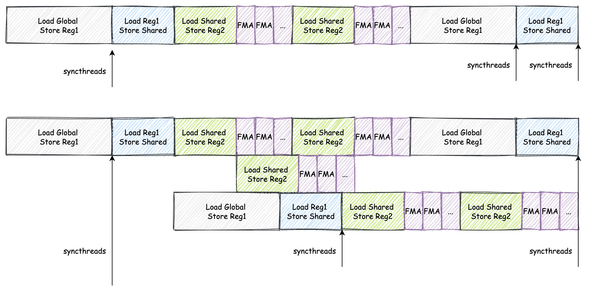

# 双缓冲

我们前面实现的 Kernel 都是单缓存的。单缓存是指申请单块共享内存，缓存全局数据，申请单块寄存器内存，缓存共享数据，单块缓存不能实现读取和存储并行进行，因为数据之间存在依赖。例如单缓存场景，计算依赖共享内存数据，为保证计算前全局内存完全存入共享内存，需要进行一次同步；同样因为计算依赖共享内存数据，所以在存新一轮全局内存到共享内存前也需要进行一次同步，保证上一轮计算完成。

那么有没有办法实现读取和存储并行进行呢？答案是有的，那就是双缓存，本文将介绍双缓存的实现方法。

## 1. 优化思路

在之前的 Kernel 中， 我们在一次循环中使用了两次 `__syncthreads()` 以防止不同线程之间的数据不一致。第一个 `__syncthreads()` 是用于保证写后读的顺序，这个是无法避免的。它是为了防止部分线程还未读取 As 或者 Bs 中的内容，保证读后写（Write-After-Read）的顺序性。它本质上是因为我们在不同迭代中使用了同一块空间来保存我们所需的数据，这两次迭代中的数据之间并不存在真正的依赖关系。如果我们将其写入到其他地址上，那么就不需要使用同步了 [4]。

双缓存的优化思路是：申请双倍存储空间，将读和写分开，计算数据读取一块存储空间同时，可以同时向另一块内存写入下一轮依赖的数据，因此，只需要保证计算前待读取共享内存完成写入，即一次同步即可。

下图是双缓存的示意图：



上面的是单缓存，下面的是双缓存。可以看到，双缓存的读和写是分开的，因此可以实现读取和存储并行进行。

## 2. 代码实现

双缓存的实现方法很简单，只需要在共享内存中申请两块空间，然后在计算前后交换读写指针即可。

首先我们先看一下单缓存的实现的简略代码：

```cpp
// 声明需要用的变量
...

// 外层循环遍历矩阵块
for (uint bk_idx = 0; bk_idx < K; bk_idx += BK)
{
    // 读取数据到共享内存
    ...
    __syncthreads();

    // 计算
    ...
    __syncthreads();

    A += BK;
    B += BK * N;
}
```

可以看到，我们在读取数据到共享内存后，进行了一次同步，然后进行计算，计算完成后，再进行一次同步。下面是双缓存的实现的简略代码：

```cpp
// 声明需要用的变量
...
// 分配共享内存
__shared__ float smem_a[2][BM * BK];
__shared__ float smem_b[2][BK * BN];

float reg_a[2][WMITER * TM] = {0.0}; // 缓存 smem_a
float reg_b[2][WNITER * TN] = {0.0}; // 缓存 smem_b

...

int write_index = 0;

// 外层循环遍历矩阵块
for (uint bk_idx = 0; bk_idx < K; bk_idx += BK)
{
    // 读取数据到共享内存 smem_a[write_index] 和 smem_b[write_index]
    ...
    __syncthreads();

    // 计算
    // 加载数据到寄存器 reg_a[write_index] 和 reg_b[write_index]
    ...

    A += BK;
    B += BK * N;

    // 原来的同步就不要了
}
```

可以看到，我们在读取数据到共享内存后，不再进行一次同步，而是直接进行计算。这是因为我们在读取数据到共享内存后，可以直接进行计算，同时将下一轮的数据写入到另一块共享内存中。这样就实现了读取和存储并行进行。

完整的代码在 `sgemm_double_buffering.cu` 中，编译运行方法如下：

```bash
nvcc sgemm_double_buffering.cu -o sgemm_double_buffering
./sgemm_double_buffering 256 256 256
```

## 3. 性能测试

我们将上该内核的性能和之前的内核进行比较，我们分别计算 256x256、512x512、1024x1024、2048x2048 （Matrix 1、Matrix 2、Matrix 3、Matrix 4、Matrix 5）的矩阵乘法的性能 (us)。在 1080Ti 上运行，结果如下：


| Algorithm | Matrix 1 | Matrix 2 | Matrix 3 | Matrix 4 |
| --------- | -------- | -------- | -------- | -------- |
| Naive     | 95.5152  | 724.396  | 28424    | 228681   |
| 共享内存缓存块    | 40.5293  | 198.374  | 8245.68  | 59048.4  |
| 一维Thread Tile     | 35.215  | 174.731  | 894.779  | 5880.03  |
| 二维Thread Tile     | 34.708  | 92.946  | 557.829  | 3509.920  |
| 向量化访存     | 36.567  | 90.745  | 427.701  | 2901.475  |
| Warp Tiling     | 25.071  | 65.810  | 361.433  | 2651.449  |
| 双缓冲     | 22.383  | 62.539  | 332.631  | 2533.086  |

## 4. 总结

双缓存的策略是一种用空间换时间的策略，通过增加共享内存的大小，来减少同步的次数，从而提高计算效率。


# References

1. https://siboehm.com/articles/22/CUDA-MMM
2. https://github.com/siboehm/SGEMM_CUDA
3. https://github.com/wangzyon/NVIDIA_SGEMM_PRACTICE
4. https://linn-ylz.com/Computer-Science/CUDA/CUDA-SGEMM-optimization-notes/