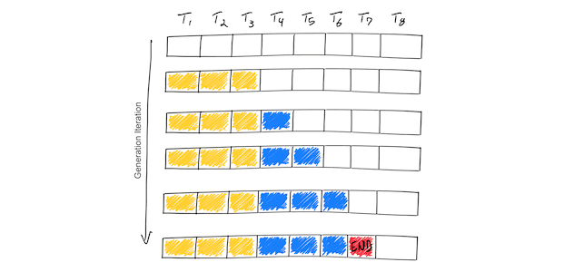
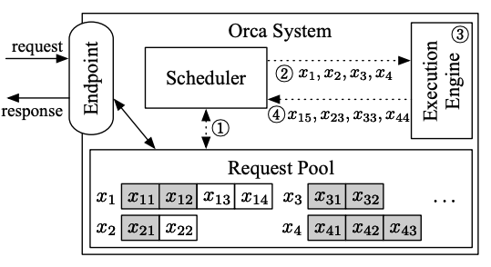

# 连续批处理

## 1. LLM 推理

LLM 推理是一个迭代过程，在每个新前馈循环后获得一个额外的完成标记。例如，如果您提示一个句子”What is the capital of California:“，它需要进行十次前馈循环才能得到完整的回答[“S”,“a”,“c”,“r”,“a”,“m”,“e”,“n”,“t”,“o”]。大模型的推理可以大致上分为，Prefill（预填充）和 Generation（生成）两个过程。

Prefill 阶段主要负责处理用户输入的提示（prompt）。在这一阶段，模型需要对整个提示中的所有 Token 进行 Attention（注意力机制）计算，以理解上下文和语义关系。

Generation 阶段则负责根据 Prefill 阶段的上下文，逐步生成新的 Token，直至生成结束标志（如 END）。在这一阶段，每生成一个新的 Token，模型仅需对最新生成的 Token 进行 Attention 计算，而无需重新处理整个提示内容。

  

上图显示了一个支持最大序列长度为 8 个标记（T1，T2，……，T8）的假设模型。从 Prompt（黄色）开始，迭代过程逐个生成一个标记（蓝色）。一旦模型生成了一个结束序列标记（红色），生成就结束了。

Continuous Batching 是另一种内存优化技术，它不需要对模型权重进行修改。之所以需要对内存进行优化是因为 LLM 推理具有以下特点：

1. LLM 推理的瓶颈是内存 IO 限制，而不是计算限制。换句话说，目前加载 1MB 的数据到 GPU 所需的时间比 1MB 的数据在 GPU 上计算所需的时间长。这意味着 LLM 推理的吞吐量很大程度上取决于能将多少批数据装入到高速 GPU 内存中；
2. GPU 内存的消耗量随着基本模型大小和标记长度的增加而增加。如果我们将序列长度限制为 512，那么在一个批处理中，我们最多只能处理 28 个序列；一个序列长度为 2048 则批处理大小最多只能为 7 个序列；

## 2. 静态批处理

在部署大规模语言模型（如 GPT 系列）时，**Batching（批处理）** 技术是提升推理效率和资源利用率的关键手段。然而，传统的静态 Batch 策略存在一些局限性：

1. 固定 Batch 大小：静态 Batch 大小在不同负载下可能不够灵活，导致资源利用不均。
2. 高延迟：在低负载时，等待达到 Batch 大小的请求可能增加单个请求的延迟。比如图里面一个 Batch 里面黄色的数据很快就处理完了，但是它要等待红色数据处理完了之后才能返回结果。
3. 内存浪费：不同请求的输入长度差异较大时，静态 Batch 可能导致大量填充（padding）操作，浪费内存和计算资源。

  

与传统的深度学习模型不同，由于大型语言模型（LLM）推理的迭代特性，批处理操作会更加复杂。这主要是因为在一个批次中，某些请求可能会比其他请求提前“完成”，但释放其资源并将新请求添加到批次中比较麻烦，因为新请求可能处于不同的完成阶段。这导致 GPU 的利用率下降 [^1]，尤其是在批次中的序列生成长度不一致时。例如，右图中序列 1、3 和 4 的结束符之后出现的白色空白。

:::tip

静态批处理中，GPU 的利用率有多低？

这取决于批次中序列的生成长度。例如，如果用 LLM 来做分类任务，只生成一个 token。在这种情况下，每个输出序列的大小都是相同的（1 个 token）。如果输入序列的长度也一致（比如 512 个 token），那么静态批处理可以达到最佳的 GPU 利用率。但对于依赖 LLM 的聊天机器人服务来说，输入序列和输出序列的长度并不是固定的。目前，一些专有模型的最大上下文长度已经超过了 8000 个 token。使用静态批处理时，生成输出的长度差异可能会导致 GPU 的严重低效利用。

:::

下图展示了使用静态批处理的 LLM 推理系统的整体流程。

  

系统的核心部分是调度器 (Scheduler) 调度的主要职责有 4 点：

1. 从队列中取出请求并生成一个批次
2. 安排 Execution Engine（例如 FasterTransformer）处理这个批次
3. Execution Engine 通过多次运行模型来处理这个批次的请求
4. 把生成的文本返回给服务系统

图中，系统安排引擎同时处理两个请求（x1: “I think”，x2: “I love”），引擎分别为 x1 生成了 “this is great”，为 x2 生成了 “you”。

这样的处理逻辑就会出现上面说到的问题，即 GPU 利用率低下。因为 x1 的生成速度比 x2 慢，x2 生成完之后，x1 还没有生成完，这样就会导致 GPU 有空闲时间。

## 3. Continuous Batching（连续批处理）

### 3.1 Orca 

OSDI 2022 上发表的 Orca [^2] 是第一篇解决这个问题的论文。它采用了迭代级调度，其中批大小根据每次迭代确定。一旦批中的一个序列完成生成，就可以在其位置插入一个新的序列，从而实现比静态批处理更高的 GPU 利用率。

下面的动图可以很好的说明 Orca 的工作原理：

  

想要实现上面的调度效果有两个关键问题：

**难点 1: 如何处理提前完成和新加入的请求问题**

现有系统的一个主要问题是，Server System 和 Execution Engine 只有在以下两种情况下交互：

1. Server System 在 Engine 空闲时调度下一批请求
2. Engine 处理完当前批次的请求

换句话说，系统按请求的批次调度执行，Engine 会保持一个固定的请求批次，直到所有请求都完成。这在处理生成模型时容易产生问题，因为每个请求所需的迭代次数不同，可能有的请求比其他请求更早完成，这也就是我们前面反复提到的问题。

为了解决上述问题，Orca 提出**按迭代的粒度进行调度**。简单来说，调度器重复以下步骤：

1. 选择下一批要运行的请求
2. 调用 Engine 为选中的请求执行一次迭代
3. 接收该迭代的执行结果

由于调度器在每次迭代后都会收到返回结果，它可以检测到请求是否完成，并立即将生成的词汇返回给客户端。对于新到达的请求，它可以在当前迭代结束后被调度，极大减少了排队延迟。通过迭代级调度，调度器完全掌控每次迭代中处理多少个请求和选择哪些请求。

下图展示了 ORCA 系统的架构及其基于迭代级调度的工作流程。ORCA 提供了一个入口（例如 HTTPS 或 gRPC），用于接收推理请求并发送响应。这个入口会将新到的请求放入请求池，池负责管理系统中所有请求的生命周期。调度器会监控请求池，并负责从中选择一组请求，安排执行引擎对这些请求进行一次迭代，接收引擎返回的执行结果（即生成的输出），并将每个输出结果追加到相应的请求中。引擎负责执行实际的张量运算。

  

调度器首先与请求池交互，决定接下来要运行哪些请求，然后调用引擎处理四个已选请求（x1, x2, x3, x4）。对于首次调度的请求，调度器会提供输入给引擎。在图中的例子中，x3 和 x4 尚未运行任何迭代，因此调度器将 x31 和 x32 交给 x3，将 x41、x42 和 x43 交给 x4。引擎运行这些请求的一次迭代，并返回生成的输出（x15, x23, x33, x44），每个请求都会得到一个输出结果。一旦某个请求处理完成，请求池会移除该请求并通知入口发送响应。这样 ORCA 的调度器可以在每次迭代中动态调整处理的请求

**难点 2: 任意请求的批处理**

为了提高效率，执行引擎应该能够批量处理任何选定的请求。如果没有批处理功能，就必须逐个处理每个选定的请求，无法充分利用 GPU 的强大并行计算能力。

然而，即使是两个请求（xi, xj），在下一次迭代中它们的执行也未必能合并为批量处理。这种情况有三种：

1. 两个请求都处于初始阶段，但输入的 token 数量不同（如上图中的 x3 和 x4）
2. 两个请求都处于 Decode 阶段，但每个请求正在处理不同索引的 token（x1 和 x2）
3. 两个请求处于不同阶段：Prefill 阶段或 Decode 阶段（x1 和 x3）

要进行批处理，多个请求的执行必须由相同的操作组成，且每个操作的输入张量形状必须一致。对于第一种情况，由于输入 token 数量不同，请求的输入张量的“长度”维度不相等，无法批处理。第二种情况中，Attention 的键和值张量的形状不同，因为每个请求处理的 token 索引不同。第三种情况中，不同阶段的迭代无法批处理，因为它们的输入 token 数量不同；初始阶段的迭代同时处理所有输入 token，而增量阶段的每次迭代只处理一个 token（假设使用 fairseq-style 的增量解码）。

只有当两个请求处于相同阶段且输入 token 数量相同时，批处理才适用。在实际工作负载中，这一限制大大降低了批处理的可能性，因为调度器需要等待两个能够同时批处理的请求出现。输入张量 x3 和 x4 可以组成一个形状为[$\sum$L,H] = [5,H]的二维张量，不需要显式的批处理维度。这个张量可以用于所有非 Attention 操作，包括 Linear、LayerNorm、Add 和 GeLU 操作，因为这些操作不需要区分不同请求的张量元素。另一方面，Attention 操作需要区分请求（即需要批处理维度），以便仅计算同一请求的词汇之间的 Attention。

Ocra 中引入了**选择性批处理机制**技术；它在 Attention 操作中拆分批次，单独处理每个请求，而对其他操作进行基于词汇（而非请求）的批处理，不需要区分请求。

下图展示了 选择性批处理机制如何处理一批请求（x1, x2, x3, x4）。

  

这批请求共有 7 个输入词汇要处理，所以输入张量的形状为 [7,H]，然后应用非 Attention 操作。在 Attention 操作之前，插入一个 Split 操作，将张量按请求拆分，并分别对每个请求运行 Attention 操作。Attention 操作的输出通过 Merge 操作重新合并为形状为 [7,H] 的张量，恢复批处理功能，以继续后续操作。

为了让 Decode 阶段的请求可以使用前几次迭代中处理的 Attention 键和值，ORCA 维护了一个 Attention 键/值管理器（KV Cache）。该管理器为每个请求分别保存这些键和值，直到调度器明确要求移除某个请求的键和值（例如该请求处理完成时）。Decode 阶段的 Attention 操作（如 x1 和 x2）使用管理器中保存的先前词汇的键和值（如 x1 的 x11, x12, x13；x2 的 x21），并结合当前词汇的查询、键和值（通过 Split 操作产生），以计算当前词汇与之前词汇之间的 Attention。

这样，ORCA 通过迭代级调度和选择性批处理机制，实现了高效的 LLM 推理。

OCRA 还没考虑 KVCache 内存管理优化，它每个序列预先分配 max token 数的作为 KVCache 显存空间。OCRA 的实验都是按照 max token 来生成。后续的工作也对这点进行了优化，下面我们来看看 vLLM 和 LightLLM 的连续批处理算法。

### 3.2 vLLM 中的连续批处理

vLLM[^3] 在 Iteration-level Batching 时候 prefill 和 decoding 是分开的，一个 Batching step 要么处理 decoding 要么处理 prefill。这样实现比 OCRA 更简单了，prefill 直接调用 xformers 处理计算密集的 prefill attention 计算；decoding 手写 CUDA PageAttention 处理访存密集的 Attention 计算

:::note

Page Attention 是一种显存优化技术，我们会在下篇文章中介绍。

:::

vLLM 和 ORCA 的不同之处在于，vLLM 将 prefill 和 decoding 两个阶段在迭代级别的批处理（Iteration-level Batching）中分离。在每一个批处理步骤中，vLLM 只处理 prefill 或 decoding，而不是像 ORCA 那样在同一个步骤中处理两个阶段。这使得实现更加简单，尤其是在处理复杂的大模型时。

不过因为 Prefill 过程会抢占 decoding 的 step 前进，如果输入 prompt sequence length 过长，所有 decoding 过程都需要等待，造成大家更长的延迟，因此留下了一些优化空间。

### 3.3 LightLLM 中的连续批处理

LightLLM 通过将长的 prompt request 分解成更小的块，在多个 forward step 中进行调度，从而让每个 forward 的计算量保持均衡。只有当最后一个块的 forward 计算完成后，整个 prompt request 的生成才结束。而短的 prompt request 则可以用精确的 step 填充计算空隙，以确保所有请求的平均延迟更为稳定。这里我们暂时先只介绍一下 LightLLM 中连续批处理的核心思想，后面有机会我们再结合源码来深入了解。

## 4. 总结

连续批处理是一种内存优化技术，它不需要对模型权重进行修改。在大型语言模型（LLM）推理中，连续批处理可以提高 GPU 利用率，减少内存浪费，提高推理效率。Orca 是第一篇解决这个问题的论文，它采用了迭代级调度，其中批大小根据每次迭代确定。vLLM 和 LightLLM 也提出了连续批处理的方法，它们在迭代级别的批处理中分离了 prefill 和 decoding 阶段，以简化实现。

[^1]: https://www.anyscale.com/blog/continuous-batching-llm-inference
[^2]: Orca: A Distributed Serving System for Transformer-Based Generative Models
[^3]: vLLM: https://github.com/vllm-project/vllm